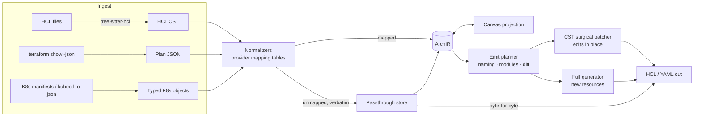
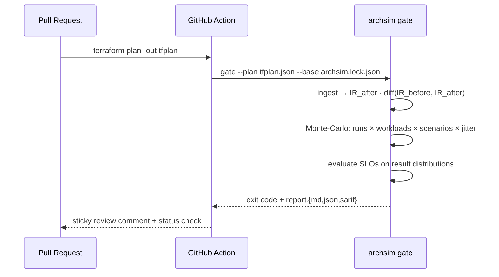
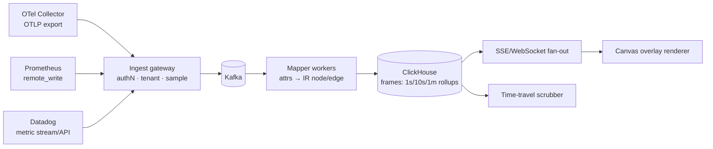

# ArchSim v2 — Enterprise Digital Twin Platform
## Technical Architecture, Data Contracts & Execution Roadmap

**Status:** Design proposal · **Baseline:** ArchSim 1.8.0 (97 templates, 116 components, analytic simulator, 998-check verification suite)
**Author's position:** This is not a greenfield design. Every capability below is anchored to code that already ships — and the document is explicit about what carries over, what gets extracted, and what must be rewritten.

---

## 0. Framing: what v1 already gave us

Before designing v2, an honest inventory. Four v1 assets are load-bearing for this pivot:

| v1 asset | v2 role |
|---|---|
| `src/sim.js` — analytic steady-state engine (capacity split, M/M/1-flavoured knee, availability composition, `dup` retry physics) | The **fast path**. Milliseconds per run → thousands of Monte-Carlo samples per PR. Kept forever alongside the new DES engine (§4). |
| `src/share.js` payload (`{v, r, n[], e[]}`) + template format | The **embryonic IR**. v2's IR (§1) is this schema grown up: versioned, IaC-bound, SLO-carrying. Migration is a lift, not a rewrite. |
| `scripts/verify.mjs` — builds the bundle, mounts it headless, drives everything | The **headless harness pattern**. The CI gate (§2) is this idea productized: same seeded-run discipline, same "the claim is a check" philosophy. |
| Provenance classes + ±40% honesty band | The **Monte-Carlo priors**. What v1 states as a disclaimer, v2 samples as a distribution (§2.4). |

One strategic note before the requested order: **the CI Architecture Gate (§2) is the commercial wedge** — it's the capability enterprises pay for first (Spacelift/Infracost proved the "PR comment" business). But the Gate *depends on* the IaC compiler to understand PRs, so the requested build order (IaC first) is also the correct dependency order. Design proceeds as asked.

---

## 1. The Intermediate Representation (IR)

Everything hinges here. **The IR is the single source of truth; the canvas and the code are both projections of it.** Neither side "owns" the system.

### 1.1 Design principles

1. **Address-anchored identity.** Every IR node carries the *native address* of its IaC origin (`aws_lb.main`, `Deployment/checkout@ns=prod`). Round-trips survive renames on the canvas because identity lives in the binding, not the label.
2. **Opaque passthrough — the anti-tarpit rule.** Anything the mapper doesn't understand is preserved *verbatim* and re-emitted untouched. Bidirectional IaC dies when the tool destroys code it didn't model; we refuse that failure class structurally.
3. **Simulation semantics are first-class.** Capacity, latency, availability, and call semantics (sequential vs parallel fan-out) live *in the IR*, seeded from the v1 catalog, overridable per node, and later *calibrated by telemetry* (§3.4).
4. **Everything versioned, everything diffable.** The IR is a JSON document designed to live in git next to the Terraform. `git diff` on it must be human-readable.

### 1.2 Schema (TypeScript)

```typescript
// @archsim/ir — the contract every subsystem speaks

export interface ArchIR {
  irVersion: '2.0';
  meta: { name: string; createdBy: string; updatedAt: string; };

  nodes: IRNode[];
  edges: IREdge[];

  workloads: Workload[];        // traffic models the simulators consume
  slos: SLOSpec[];              // gates the CI engine enforces (§2.3)
  deployments?: DeploymentCtx[];// cloud/region/env context

  // Round-trip survival: source text the mappers chose not to model.
  passthrough: PassthroughBlock[];
}

export interface IRNode {
  id: string;                   // stable ULID — never derived from label
  kind: CanonicalKind;          // 'lb' | 'gateway' | 'app' | 'sql' | 'ledger' | ... (v1 catalog taxonomy, frozen + extended)
  label: string;

  capacity: CapacityModel;      // the simulation contract
  bindings: IaCBinding[];       // where this node lives in code (≥0)
  telemetry?: TelemetryBinding; // how observability maps back (§3.2)
  layout?: { x: number; y: number };        // canvas projection only
  overrides?: Partial<CapacityModel>;       // user/telemetry calibration
  attrs: Record<string, unknown>;           // typed per-kind extension bag
}

export interface CapacityModel {
  replicas: number;
  capPerReplica: number;        // rps — seeded from catalog, provenance-tagged
  latencyMs: LatencyDist;       // v1: {base: n}; v2 DES: {dist:'lognormal', p50, cv}
  availability: number;         // per-replica
  concurrency?: number;         // worker/thread pool size (DES §4.5)
  queueDepth?: number;          // bounded queue K (DES backpressure)
  provenance: { cls: 'benchmark'|'vendor'|'modeled'|'telemetry'; basis: string; refs: string[] };
  jitter: { capPct: number; latPct: number };  // Monte-Carlo prior — default ±40 (v1 honesty band)
}

export interface IREdge {
  id: string;
  from: string; to: string;
  callSemantics: 'sync' | 'async' | 'fanout-parallel' | 'fanout-sequential';
  protocol?: 'http'|'grpc'|'sql'|'amqp'|'kafka'|'custom';
  weight?: number;              // traffic split hint (default: even, as v1)
  timeoutMs?: number;           // feeds retry/breaker models (§4)
  retry?: RetryPolicy;          // {max, backoffMs, jitter, budgetPct}
  breaker?: BreakerPolicy;      // {windowSec, errThreshold, halfOpenProbes}
}

export interface IaCBinding {
  lang: 'hcl' | 'k8s' | 'plan-json';
  file: string;                 // relative path in the repo
  address: string;              // 'module.web.aws_lb.main' | 'apps/v1:Deployment:prod/checkout'
  range?: { startByte: number; endByte: number };  // CST anchor for surgical edits
  managed: 'full' | 'partial' | 'observed';
  // 'full'    → ArchSim may regenerate this block
  // 'partial' → ArchSim edits only mapped attributes (count, instance_type…)
  // 'observed'→ read-only: render, never write
}

export interface PassthroughBlock {
  lang: 'hcl' | 'k8s';
  file: string;
  text: string;                 // verbatim — re-emitted byte-for-byte
  anchorAfter?: string;         // ordering hint for emission
}

export interface SLOSpec {
  id: string;
  scope: 'system' | { node: string } | { edge: string };
  metric: 'p99_ms' | 'p95_ms' | 'error_rate' | 'availability' | 'throughput_rps' | 'monthly_cost_usd';
  op: '<=' | '>=';
  threshold: number;
  under: WorkloadRef | 'all';   // which workload/scenario must satisfy it
}

export interface Workload {
  id: string;
  arrival: { dist: 'const'|'poisson'|'diurnal'|'spike'; rps: number; params?: Record<string, number> };
  mix?: { readPct: number };    // feeds v1's read/write capacity split
}
```

### 1.3 Why this IR survives contact with reality

- **The v1 simulator runs on it today** with a 20-line adapter (`IRNode.capacity` → catalog-shaped spec; edges already match after the {from,to} normalization we shipped in 1.6).
- **`managed` tri-state** is the political contract with platform teams: "observed" lets ArchSim render a brownfield estate *without asking permission to own it* — the adoption unlock every IaC tool that demands ownership fumbles.
- **`jitter` per node** turns v1's blanket ±40% disclaimer into a per-component prior that telemetry can tighten (§3.4): the honesty band becomes a *learned* quantity.

---

## 2. Capability 1 — Bidirectional IaC Compiler

### 2.1 Architecture



### 2.2 Ingestion: two modes, deliberately

**Mode A — Plan JSON (exact, ship first).** Raw HCL is a *programming language*: `for_each`, `dynamic`, functions, module indirection. Evaluating it ourselves is a multi-year tarpit. But `terraform show -json tfplan` hands us the **fully evaluated resource graph** — every count expanded, every variable resolved — as stable JSON Terraform itself guarantees. Same move for K8s: `kubectl get -A -o json` or rendered Helm output beats parsing templated YAML.

> Mode A gives exactness at the cost of requiring a plan step. For the CI gate (§3) a plan **already exists in every PR pipeline** — the dependency is free where it matters most.

**Mode B — Static HCL (best-effort, ship second).** tree-sitter-hcl produces a **CST** (concrete syntax tree — comments and formatting preserved), we partially evaluate literals and simple references, and anything dynamic degrades gracefully: the resource renders as a node with `capacity.provenance.cls = 'modeled'` and a badge — *"count unresolved: shown as 1×"*. Honesty over hallucination, the house rule.

### 2.3 The mapping tables (the real product)

Normalization is data, not code — a versioned, community-extensible table:

```typescript
interface MappingRule {
  match: { provider: 'aws'|'gcp'|'azure'|'k8s'; type: string; when?: AttrPredicate };
  kind: CanonicalKind;
  capacity: (attrs: Attrs) => Partial<CapacityModel>;   // instance_type → cap/lat via sizing table
  edges?: (attrs: Attrs, ctx: GraphCtx) => EdgeHint[];  // security groups, target group ARNs,
                                                        // K8s Service selectors, env-var URLs → edges
  emit: EmitTemplate;                                    // reverse direction (§2.4)
}

// Examples
{ match:{provider:'aws', type:'aws_lb'},                          kind:'lb', ... }
{ match:{provider:'aws', type:'aws_db_instance'},                 kind:'sql',
  capacity: a => sizeFromInstanceClass(a.instance_class) }        // db.r5.large → cap≈5000, provenance:'vendor'
{ match:{provider:'aws', type:'aws_sqs_queue'},                   kind:'queue', ... }
{ match:{provider:'k8s',  type:'apps/v1:Deployment'},             kind: inferFromImage,   // redis→cache, postgres→sql
  capacity: a => ({ replicas: a.spec.replicas }) }
{ match:{provider:'aws', type:'aws_qldb_ledger'},                 kind:'ledger', ... }
// No rule matched → kind:'custom' + full passthrough. Never dropped, never guessed.
```

**Edge inference** is where visual value concentrates: target-group attachments, K8s `Service` selector → `Deployment` matches, `DATABASE_URL`-shaped env vars, security-group references. Each inferred edge carries `confidence: high|medium|low` and low-confidence edges render dashed until confirmed — the user's confirmation writes back an explicit annotation (`archsim.io/edge: sql-main`) so confidence becomes permanent.

### 2.4 Emission: patch, don't regenerate

The classic bidirectional failure: tool regenerates the file, obliterating comments, formatting, and everything it didn't model. Our contract:

1. **Existing resource, mapped attribute changed** (replicas 3→7 on canvas) → **CST surgical patch**: locate the binding's byte range, rewrite *only* `count = 7` / `replicas: 7`. Comments, ordering, whitespace untouched. `terraform fmt` idempotency asserted in tests.
2. **New node drawn on canvas** → **full generation** from the rule's `EmitTemplate` into `archsim.generated.tf` (or a user-chosen file), with variables extracted per house conventions (region, tags) and a header comment linking back to the IR node id.
3. **Node deleted on canvas** → never silently deleted in code. Emitted as a **removal proposal** in the diff review (§2.5); the user applies it in their PR.
4. **Passthrough blocks** → byte-for-byte re-emission, position-stable.

### 2.5 Three-way reconciliation

Both projections can change between syncs (canvas edits vs. teammate's HCL commit). We keep `baseIR` (last sync point) and merge like git:

```
merge(baseIR, canvasIR, codeIR):
  for each node/edge/attr:
    canvas changed, code didn't  → take canvas → emit patch
    code changed, canvas didn't  → take code   → update canvas
    both changed, same value     → converge silently
    both changed, different      → CONFLICT: surfaced in a review panel,
                                   never auto-resolved for anything that costs money
```

Golden-file corpus is the test spine (the v1 suite philosophy, transplanted): **50+ real-world Terraform/K8s repos, each asserting `emit(ingest(x))` is byte-identical for untouched regions** — round-trip fidelity as a build gate, exactly like the 998 checks gate today's claims.

---

## 3. Capability 2 — Headless Engine & CI Architecture Gate

### 3.1 Package extraction (Phase 0 of the roadmap)

```
@archsim/core   sim.js + catalog + slo + future + faults — already ~pure; DOM references: zero.
@archsim/des    the discrete-event engine (§5) — same IR in, richer traces out.
@archsim/iac    §2's compiler.
@archsim/cli    the gate. Node 20+, single binary via pkg/bun for airgapped runners.
```

The web app becomes the first *consumer* of `@archsim/core` rather than its owner — the extraction is proven the moment `verify.mjs` passes against the package build.

### 3.2 CLI contract

```bash
archsim gate \
  --plan  tfplan.json            # PR's evaluated infra (Mode A ingest)
  --base  archsim.lock.json      # committed IR of main (the "twin lockfile")
  --slo   .archsim/slo.yaml \
  --workloads .archsim/workloads.yaml \
  --runs 500 --seed 42 \
  --out gate-report.md --format md,json,sarif
# exit 0 pass · 1 SLO violation · 2 error-budget-risk warning (configurable severity)
```

```yaml
# .archsim/slo.yaml — the thresholds that become PR law
slos:
  - metric: p99_ms        op: "<=" threshold: 800   under: peak
  - metric: error_rate    op: "<=" threshold: 0.001 under: all
  - metric: availability  op: ">=" threshold: 0.999
  - metric: monthly_cost_usd op: "<=" threshold: 42000
scenarios:            # chaos drawn from the v1 fault library, now CI-addressable
  - fault: az         # one AZ dark
  - fault: retry      # 40% duplicate storm on the hottest write path
  - fault: crash      target: "kind:sql"
workloads:
  - id: peak   arrival: {dist: diurnal, rps: 12000, params: {peakFactor: 4}}
```

### 3.3 Gate pipeline



### 3.4 Monte-Carlo design — the honesty band becomes math

Each of the N runs samples:
- **Parameters:** every node's `capPerReplica` and `latencyMs` drawn from its `jitter` prior (default ±40% — v1's stated band, now *operationalized*; telemetry-calibrated nodes carry tighter priors, `provenance:'telemetry'`).
- **Workload:** arrival realization from the declared distribution (diurnal peak, spike).
- **Scenario:** fault(s) from the weighted scenario list, applied through the existing `fx` mechanism (`{drop, capMul, noCache, dup}` — unchanged from 1.8).

Per run the **analytic engine** answers in ~1ms; 500 runs × 4 scenarios lands under 5 seconds — comfortably inside PR-comment latency. Result per SLO is a distribution → we report *probability of violation*, not a point verdict: "p99 ≤ 800ms holds in **86%** of sampled worlds (was 99% on main)". Runs flagged interesting (breaker flapping, storm feedback) can be **escalated to the DES engine** (§5) for a time-resolved trace — the two engines are a fidelity ladder, not rivals.

Determinism: `--seed` + sorted-input hashing → identical comment on re-run; the seed is printed in the report so any run is reproducible locally: `archsim replay --seed 42 --run 371`.

### 3.5 The PR comment (the product surface)

```markdown
## 🏗️ ArchSim Architecture Gate — ❌ 1 violation · ⚠️ 1 risk
**Change:** `aws_db_instance.main` count 2→1 · `aws_lambda.checkout` memory 512→256

| SLO | main | this PR | verdict |
|---|---|---|---|
| p99 ≤ 800ms (peak) | 99% of runs | **61% of runs** | ❌ |
| availability ≥ 99.9% | 99.97% | **99.89%** | ❌ SPOF: `sql.main` now 1 replica |
| error rate ≤ 0.1% (AZ-loss) | 0.04% | 0.31% | ⚠️ |
| monthly cost | $38,120 | $31,540 | ✅ −17% |

**Cheapest fix found** (convergent, from the future-ready engine): `sql.main` 1→2 replicas
restores both gates at **+$410/mo** — 6% of the savings this PR banks.
<sub>500 runs · seed 42 · reproduce: `archsim replay --seed 42`</sub>
```

That last line is the moat: v1's *convergent quick-fix engine* runs inside the gate, so the comment doesn't just fail the PR — **it prices the repair**. No competitor comments do that.

---

## 4. Capability 3 — Telemetry Ingestion & Digital Twin

### 4.1 Two-tier architecture (deliberate)

**Tier 1 — Twin Lite (browser-only, ship first).** The canvas *pulls*: PromQL range queries / Datadog API / an OTLP-HTTP collector with CORS, straight from the browser on a 5–10s tick. No ArchSim servers, no data custody, enterprise-security-review-sized-zero. This alone delivers live heatmaps **and** time-travel (a replay is just a range query over the past — the vendor's TSDB is the replay store we don't have to build).

**Tier 2 — Twin Server (enterprise).** For fleets and long retention:



*(Yes — the ingest pipeline is itself the LLM-API-Platform template's shape: accept fast, process behind a log. We should ship our own dogfood diagram.)*

### 4.2 Mapping telemetry → nodes and edges

```typescript
interface TelemetryBinding {
  service?: string;             // OTel service.name
  k8s?: { namespace: string; workload: string };
  promSelector?: string;        // '{job="checkout"}'
  ddScope?: string;
  confidence: 'declared' | 'matched' | 'heuristic';
}
```

Resolution ladder, per incoming series/span:
1. **Declared** — `archsim.io/node=<ulid>` resource attribute/label (we generate these in emitted IaC: the compiler and the twin close the loop).
2. **Matched** — `service.name` / `k8s.deployment.name` equals an IaC binding address.
3. **Heuristic** — fuzzy name match, rendered dashed until a human confirms (confirmation persists as a declared binding — same confidence-graduation pattern as edge inference).

**Edges from traces:** span pairs where `parent.service ≠ child.service` aggregate into per-edge flow: `rate(A→B)`, `p99(A→B)`, `err(A→B)`. `span.kind=client` + `peer.service`/`db.system` catches uninstrumented sinks. **Unmapped services materialize as ghost nodes** — the twin *discovers* what the diagram forgot, which is half the enterprise value ("your architecture review is missing four services prod knows about").

### 4.3 The frame — one contract for live and replay

```typescript
interface TelemetryFrame {          // 1s (live) / 10s (replay default) / 1m (long retention)
  ts: number;
  nodes: Record<NodeId, { rps: number; p50: number; p99: number; errRate: number;
                          saturation?: number; queueDepth?: number; inflight?: number }>;
  edges: Record<EdgeId, { rps: number; p99: number; errRate: number }>;
}
```

- **Live heatmap:** `observedSaturation = frame.nodes[id].rps / (IR capacity)` — real traffic against the *modeled* ceiling. When observed p99 knees at 60% of modeled capacity, the twin has caught the model lying → one-click **calibration**: write telemetry-derived `capPerReplica` into `overrides`, provenance flips to `'telemetry'`, the jitter prior tightens. **The model learns from production; the honesty band earns its keep.**
- **Backpressure overlay:** queue-kind nodes render `queueDepth` and drain-rate deficit; edges pulse-width encodes rps, color encodes errRate — same renderer live and replayed, by construction.

### 4.4 Incident Time-Travel Replay

An incident bookmark is `{tStart, tEnd, annotations[]}`. The scrubber requests frames (Tier 1: live range-query; Tier 2: ClickHouse) and feeds the identical overlay renderer at chosen speed. Storage arithmetic for Tier 2: ~200 nodes+edges × ~40B × 0.1 fps ≈ **70 MB/day/system at 10s resolution** — 90-day retention is a rounding error. Killer workflow: scrub to T-4min, watch the retry storm bloom edge-by-edge, then click **"Reproduce in simulator"** — the frame's workload + the incident's fault signature seed a DES run (§5), turning a postmortem into a regression test the CI gate (§3) enforces forever. *That closed loop — incident → replay → simulation → gate — is the platform.*

---

## 5. Capability 4 — Discrete-Event Chaos & Failure Propagation Engine

### 5.1 Position: a fidelity ladder, not a replacement

The analytic engine answers *steady-state* questions in microseconds and stays the interactive/MC workhorse. The DES engine answers **time-dependent** questions the steady-state model cannot express: storms that feed back, breakers that flap, queues that drain after a burst, thread pools strangled by a slow dependency. Same IR in; a *trace* out.

### 5.2 Node model — G/G/c with bounded queue

Each service node: `c = concurrency` workers, FIFO queue bounded at `K = queueDepth`, service time `S ~ Lognormal(μ, σ)` fitted so `median = latencyMs.p50`, `cv` from the latency distribution spec (default 0.5; telemetry can fit it). Admission when queue full: **shed** (503, counts to errRate) or **block** per node policy.

### 5.3 The event loop (the whole engine is small)

```python
# Priority queue of events; deterministic under a seeded RNG.
while events and now < horizon:
    ev = heappop(events); now = ev.t
    match ev.kind:
        case ARRIVAL(req, node):
            if node.inflight < node.c:               # a worker is free
                node.inflight += 1
                push(COMPLETE, now + sample_service(node, rng), req, node)
            elif len(node.queue) < node.K:
                node.queue.append((req, now))        # wait; latency accrues
            else:
                finish(req, SHED)                    # backpressure made visible

        case COMPLETE(req, node):
            downstream = plan_calls(node, req)       # from IREdge.callSemantics
            if downstream.sync:                      # ⚠ worker is HELD across sync calls —
                hold_worker(node, req)               #   this is the thread-starvation channel
                fanout(downstream, req)              # parallel: join on max; sequential: chain
            else:
                release_worker(node); drain_queue(node)
                fanout(downstream, req)              # async: fire and release

        case DOWNSTREAM_DONE(req, node):             # sync join complete
            release_worker(node); drain_queue(node)
            reply_upstream(req)

        case TIMEOUT(req, edge):                     # armed at call time: now + edge.timeoutMs
            record_error(edge)
            maybe_retry(req, edge, rng)              # §5.4 — where storms are born

        case PROBE(edge):                            # breaker half-open trial (§5.5)
            send_probe(edge)
```

Percentiles from completed-request latencies via **t-digest** (bounded memory at any horizon). Invariant checks run inside the engine as assertions — Little's law `L = λ·W` per node within tolerance, flow conservation per edge — the suite discipline, embedded in the physics.

### 5.4 Retry storms — the amplification recurrence

Client policy per edge: `retry = {max, base, jitter, budgetPct}`. Effective arrival at a struggling node:

```
λ_eff(t) = λ(t) + Σ_k  p_fail(t − d_k) · λ_retry_k(t − d_k)      d_k = timeout + backoff_k
```

The feedback loop the analytic `dup` factor only *asserts*, the DES *produces*: timeouts raise `p_fail`, which raises `λ_eff` after delay `d`, which raises utilization → latency → more timeouts. With naive retries the fixed point is saturation; with a **retry budget** (retries ≤ `budgetPct` of successes, sliding window) the loop damps — and the engine shows the damping, run against the same 🔁 fault users know from v1 chaos. Exponential backoff with **full jitter** (`sleep = U(0, base·2^k)`) is the default emitted policy because the DES demonstrably shows synchronized-retry combs without it.

### 5.5 Circuit breaker — per-edge state machine

```python
class Breaker:                              # sliding-window, count-based
    state = CLOSED; window = Ring(size=W)
    def on_result(self, ok):
        self.window.push(ok)
        if self.state == CLOSED and self.window.err_rate() > θ and self.window.n >= n_min:
            self.state = OPEN; schedule(PROBE, now + cooloffMs)
    def on_call(self):
        if self.state == OPEN:        return FAIL_FAST          # errors, at zero latency —
        if self.state == HALF_OPEN:   return PROBE_ONE          #   which SHRINKS upstream hold time:
        return PASS                                              #   the breaker is a latency firewall
    def on_probe(self, ok):
        self.state = CLOSED if ok else OPEN
        if not ok: schedule(PROBE, now + cooloffMs)
```

The DES makes the non-obvious visible: **an open breaker *improves* upstream p99** (fail-fast beats waiting) — the cascade-severing mechanism, measured rather than asserted.

### 5.6 Thread starvation — the quiet cascade channel

With sync calls, a worker is held for `hold = service + downstream_wait`. Utilization:

```
ρ = λ · E[hold] / c
```

A downstream slowdown inflates `E[hold]`, so a node can starve at **unchanged λ and healthy CPU** — the grey failure that pages nobody until the front door drowns. Worked example the docs will carry: `c=200`, `λ=400/s`, own service 20ms, downstream p50 30ms → `E[hold]≈50ms`, `ρ=0.10`. Downstream degrades to 450ms → `E[hold]≈470ms`, `ρ=0.94` — one dependency's latency just consumed the fleet, with zero CPU signal. Timeouts + breakers are precisely `E[hold]` caps; the DES lets users *watch* the cap work.

### 5.7 Network partitions

Partition = edge predicate over time windows: affected calls resolve as TIMEOUT (not instant error) — the expensive kind of failure, holding workers for the full `timeoutMs` and feeding §5.4 and §5.6 simultaneously. Split-brain scenarios pair the partition with the v1 quorum model: the DES shows the minority side's writes timing out while the analytic quorum verdict explains *why* — the two engines teaching in stereo.

### 5.8 Validation plan

1. **Closed-form agreement:** M/M/c cases where Erlang-C is exact — DES within CI bands of theory, as suite checks.
2. **Cross-engine consistency:** steady, sub-knee workloads → DES ≈ analytic within jitter; divergence beyond the knee is *expected and documented* (that's the DES's reason to exist).
3. **Metamorphic tests:** doubling `c` at fixed λ never raises p99; adding a retry budget never raises steady-state error rate; opening a breaker never raises upstream p99. Property tests over seeded runs.

---

## 6. Phased Execution Plan

| Phase | Scope | Duration | Exit criterion (a check, not a vibe) |
|---|---|---|---|
| **0 — Extraction & IR freeze** | `@archsim/core` extracted; IR 2.0 schema + adapters; share-links & templates migrate; `verify.mjs` passes against the package | 2–3 wk | The 998-suite green on `@archsim/core` build; IR JSON-schema published |
| **1 — IaC ingest (Mode A)** | Plan-JSON + K8s-live ingest → IR → canvas render; AWS mapping table (top ~40 resources) + K8s core kinds; edge inference w/ confidence | 4–6 wk | 20-repo corpus renders with 0 dropped resources (passthrough counted, not lost) |
| **2 — Codegen + round-trip** | CST patcher (HCL & YAML), full generation for new nodes, three-way merge, conflict UI | 4–6 wk | Golden corpus: `emit(ingest(x))` byte-identical outside edited ranges; `terraform validate` green on all generated output |
| **3 — CLI + CI Gate (MVP revenue)** | `@archsim/cli`, slo.yaml, MC runner on analytic engine, md/json/SARIF reports, GitHub Action + GitLab template, sticky comments, **quick-fix pricing in the comment** | 3–4 wk | Gate runs <60s on the corpus; seeded reruns byte-identical; dogfooded on ArchSim's own repo |
| **4 — DES engine** | §5 behind `--engine des`; storm/breaker/starvation/partition scenarios; validation suite (closed-form, cross-engine, metamorphic); canvas timeline view of DES traces | 4 wk | Erlang-C agreement checks green; the three metamorphic properties hold across 1k seeded runs |
| **5 — Twin Lite** | Browser-pull PromQL/OTLP/Datadog; binding resolution ladder; live heatmap + drift calibration; ghost-node discovery | 4–5 wk | Demo cluster: live heatmap within 2 ticks; one-click calibration flips provenance to `telemetry` |
| **6 — Twin Server + Time-Travel** | Gateway→Kafka→ClickHouse, frame rollups, scrubber, incident bookmarks, **"reproduce in simulator"** loop into the gate | 6–8 wk | A replayed incident regenerates as a DES scenario whose gate check fails pre-fix and passes post-fix |

**Risk register (the honest column):**

| Risk | Mitigation baked into the design |
|---|---|
| Round-trip fidelity tarpit (the graveyard of every "visual Terraform") | Passthrough-verbatim rule; `managed` tri-state; Mode A exactness; byte-identity golden gates |
| Mapping-table maintenance burden | Tables are data + community-extensible; plan-JSON reduces per-provider surface; unmapped = rendered, never dropped |
| Telemetry cardinality/cost | Frame rollups (10s default), Tier-1 pulls from *their* TSDB, sampling at the gateway |
| DES performance at scale | Fidelity ladder: analytic for MC breadth, DES for flagged depth; horizon-bounded runs; t-digest memory bounds |
| Enterprise trust (new vendor touching prod IaC) | `observed` mode adopts brownfield read-only; the gate ships value before write-access is ever requested |

---

## 7. Closing note from the trenches

The suite is the strategy. v1's differentiator was never the canvas — it was that **every claim is a check** (998 of them, run on every push, public badge). v2 wins the same way at enterprise stakes: round-trips proven byte-identical, gate verdicts seeded-reproducible, DES validated against closed forms, twins that calibrate the model against production instead of decorating it. HashiCorp owns provisioning and Datadog owns observation; the seam between them — *"will this change hold up, and can you prove it before merge?"* — is unowned. That seam is exactly the shape of this document.
